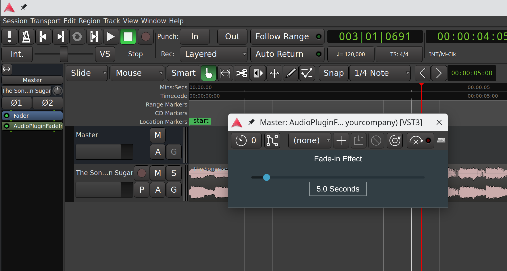

Create a JUCE Plugin for Fade-In Volume Effect
===

Objective:
---
Your task is to create a simple audio plugin using the JUCE framework that applies a fade-in
volume effect to an audio signal. The plugin should smoothly increase the volume of the
incoming audio from silence to full volume over a specified duration.

Building
---
1. Download JUCE
   * [Mac](https://github.com/juce-framework/JUCE)
   * [Windows](https://api.juce.com/api/v1/download/juce/latest/windows)
   * [Linux](https://api.juce.com/api/v1/download/juce/latest/linux)
2. Unzip the file
3. Run `Projucer`
4. Clone the repository `git clone https://github.com/diegodfrf/JUCE-fadein.git`
5. Open `AudioPluginFadeInVolumeEffect.jucer`
6. Open the project in your IDE depending on the OS
   * **Mac**:  `Builds/MacOSX/AudioPluginFadeInVolumeEffect.xcodeproj`
   * **Windows**: `Builds/VisualStudio2022/AudioPluginFadeInVolumeEffect.sln`
   * **Linux**: `Builds/LinuxMakefile/Makefile`
7. Compile the project

Getting Started
---
1. Open your favorite DAW
2. Import de plugin
3. You can control the fade-in duration in seconds. The plugin process audio in real-time. (Default = 5 seconds)

